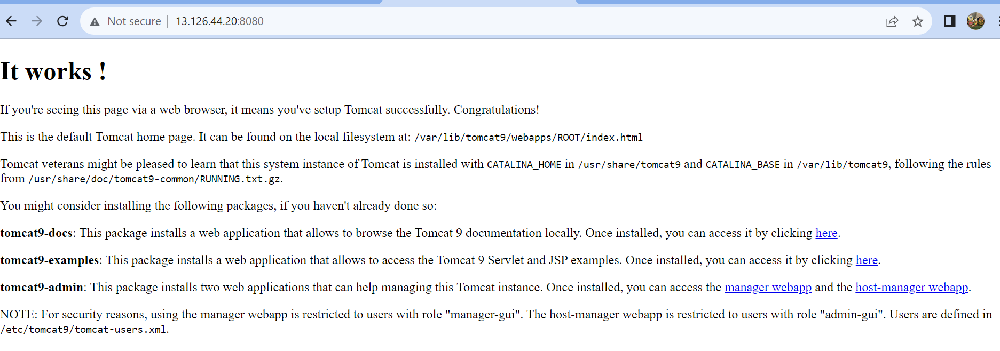
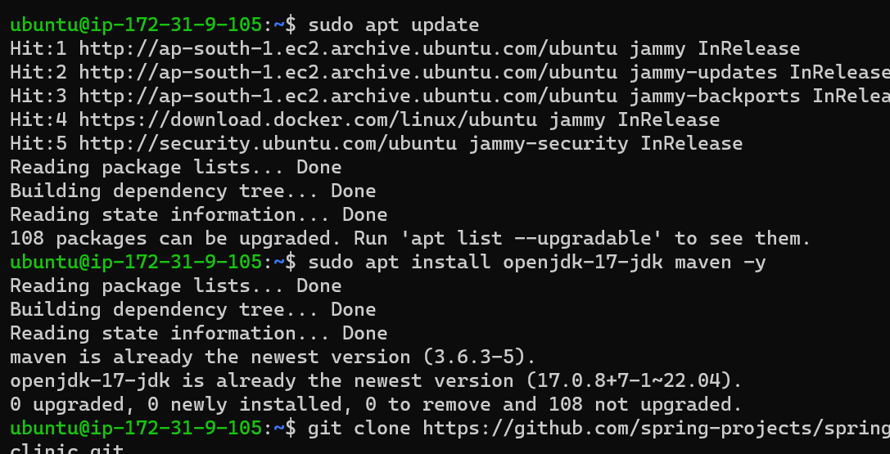

## What is Docker ?

* Docker (dock worker) is used to create containers which is standard way of packaging any application
* Docker is an open-source project that automates the deployment of
applications inside software containers


#### create instance
* To install docker
* docker script:- 
curl -fsSL https://get.docker.com -o install-docker.sh
sudo sh install-docker.sh
exit
relogin

#### check docker config
#### docker --version
clint will be conneting to server
* then start working
#### installing tomcat

#### commands
```
sudo apt update
sudo apt install net-tools openjdk-11-jdk tomcat9 -y
# to check network
ifconfig
# to check java
java -version
# to check tomcat
sudo systemctl status tomcat9
```


## Springpetclinc application
* This is spring pet clinic application
* Lets try to run this application on linux
* 
# commands 
```
sudo apt update
sudo apt install openjdk-17-jdk maven -y
git clone https://github.com/spring-projects/spring-petclinic.git
cd spring-petclinic
# java package
mvn package
java -jar target/spring-petclinic-3.0.0-SNAPSHOT.jar
```



* vi docker
by writing docker file we can run number of container

### Containerization
* For containerization I did 3 things to run the application
1. what we required to run application
2. What are the steps to start the application
2. What are the ports  our application can be access 

* Inside the container we never run a sever side application not for clinet side application

* Docker containers are meant for server side applications not for client side applications 
* -it means Interactive with Terminal

### Commands:-
* docker container ls -a 
=> shows all the containers
* docker container ls -a -q
=> shows all the containers Id
* rm stands for remove
* -f stands for forcefully
* To remove the all the containers at a time. We have to use this command.
* docker container rm -f $(docker container ls -a -q) 


 docker container run --name myhttpd1
 docker container run --name -d myhttpd1
 docker container run --name myhttpd2 -p 32000:80 -d httpd

* docker images doesn't having running or stopig state
* Lets remove all the images docker image rm -f $(docker image ls -q)

* docker image 
=> Lets create a container and login into that during running the container. Lets use alpine and ubuntu docker image

* Docker container can be executed in 3 ways
  1.detached
  2.attached
  3.interactive

 * Lets create the nginx container in detached mode -d 
 * in attached mode we can see standard input,output,error.
 * IN detached mode the container will be started in the backgroung
  $docker container run -d --name nginxd nginx


* Lets create the nginx container in attached mode.
* it runs in the background 
* In attaches the container will exited when we entier ctrl+c
  * $ docker container run --name nginxa nginx


 * Let create some images in interactive mode -it
 * interactive mode where we inside the container and try to execute something
   * $ docker container run -it --name alpint alpine /bin/sh
   * $ docker container run -it name ubnint ununtu /bin/bash


* Use exec of the docker container command 


* We can execute interactive commands by using shell


* Now we are creating container in -it mode 
* once we exit from container than that container will be notwork and even don't show in container list.


* This is not a useful approach as we are creating images manually
    * Docker has a better way i.e. Dockerfile

   *  Workflow
   

  ### Basic Instructions:
* FROM: use tag all the time (donot use latest)
* RUN: The commands to be executed while building the image to install/configure your appliation.
* CMD: This command will be executed while starting the container.
* EXPOSE: This adds ports to be exposed while starting the container 

### Springpetclinic Dockerfile
* Lets do two ways
  * use any image with java11 already as base image amazoncorretto:11
  * use any image with slim os as base image alpine:3

### Dockerfile- based on amazoncorreto:11

* FROM amazoncorretto:11
* RUN curl https://referenceapplicationskhaja.s3.us-west-2.amazonaws.com/spring-petclinic-2.4.2.jar -o spring-petclinic-2.4.2.jar
* EXPOSE 8080
* CMD ["java", "-jar", "spring-petclinic-2.4.2.jar"]

  * Lets build the image based on amazoncorreto
  

