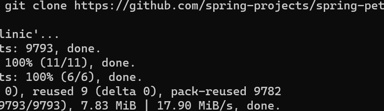

### What is Docker ?


### create instance
* To install docker
* docker script:- 
curl -fsSL https://get.docker.com -o install-docker.sh
sudo sh install-docker.sh
exit
relogin

# check docker config
# docker --version
clint will be conneting to server
* then start working
# installing tomcat

# commands
```
sudo apt update
sudo apt install net-tools openjdk-11-jdk tomcat9 -y
# to check network
ifconfig
# to check java
java -version
# to check tomcat
sudo systemctl status tomcat9
```


# Springpetclinc application
* This is spring pet clinic application
* Lets try to run this application on linux
* 
# commands 
```
sudo apt update
sudo apt install openjdk-17-jdk maven -y
git clone https://github.com/spring-projects/spring-petclinic.git
cd spring-petclinic
# java package
mvn package
java -jar target/spring-petclinic-3.0.0-SNAPSHOT.jar
```




